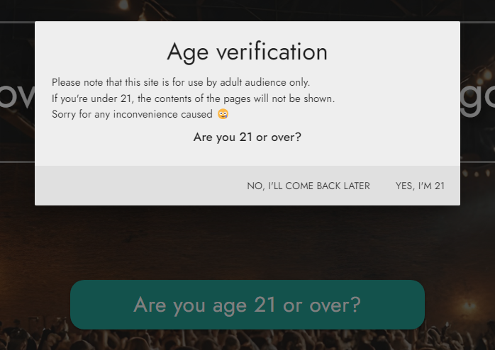
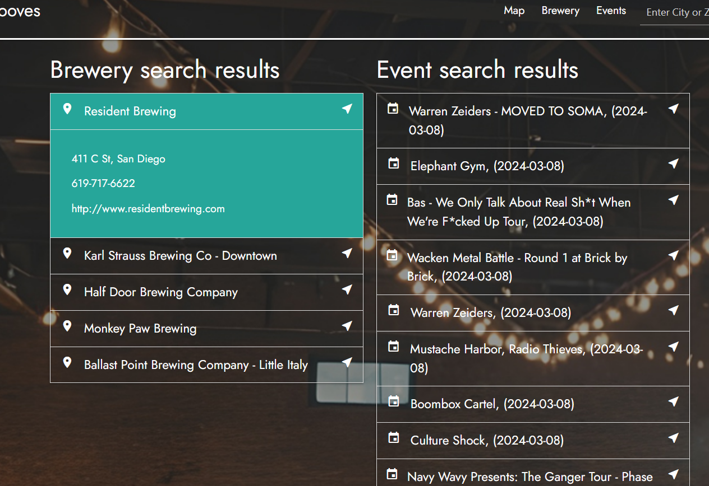
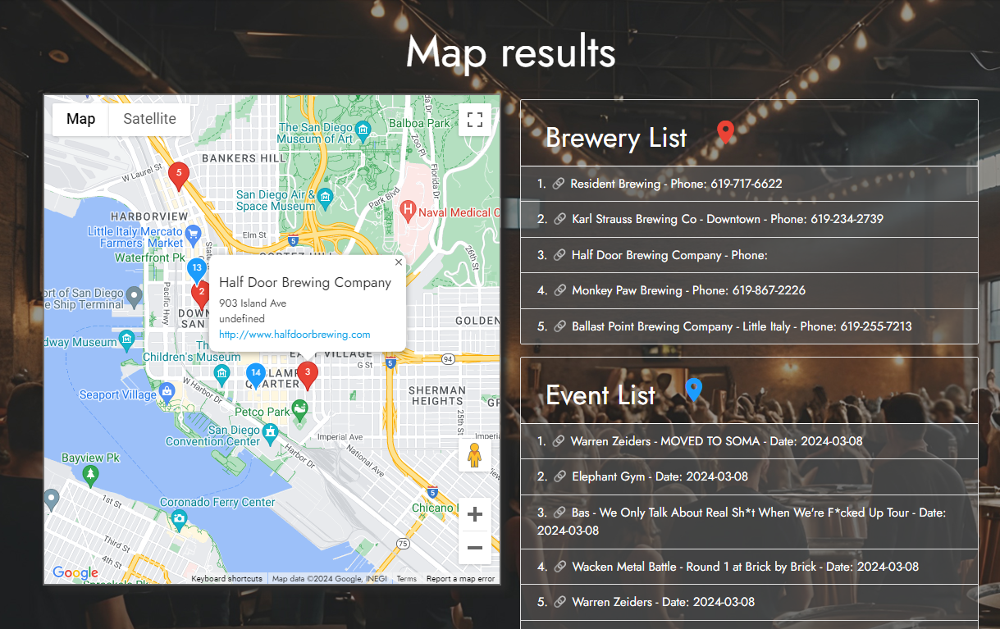
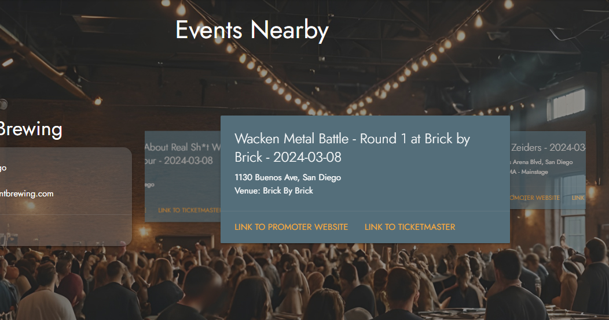

# Brews & Grooves

## Decsription

🍺 A simple website to search brewery and music events happening around the searched location. 🎸

## User Story

AS A person looking for entertainment and local breweries in new locations  
I WANT to use a search function to either locate breweries near music events I have planned, or see what local music events are near my favorite breweries  
SO THAT I can combine my favorite social activities into a single convenient schedule.

## Usage

###  Whether you're new in town or just looking for brewery or music events in happening in your city, just search and go!

## Features

🚫 Confirm age on main page  
📍 Show results of both brewery / music events within the searched city  
🎠 Click on a brewery to search by events around that location (_See our carousel function on nearby events on this page!_)  
🔗 Click on the brewery or music events website links to visit their website.  
🗺️ Show the search results on the map to plan your visit ahead  
🦭 Hover over the chat box for a surprise!  

### Age verification

### Main search result page

### Show results on map with responsive markers

### Swipe around for fun with our carousel feature 🎠

    

## Deployment

[Click to deployed page](https://brad-wall01.github.io/Brews-Grooves/)

## Credits

Special thanks to:

✨`Eric Lee`  
✨`David Salter`  
✨`Bradley William`  

for making this website happen!

> If you have want to add any features or functions, feel free to contribute!

